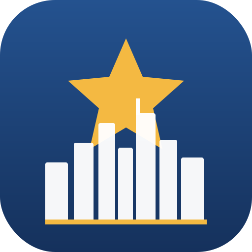

<div align="center">
  
  <h1>BigAppleTrip（紐約家庭之旅）</h1>
  <p>2026 年 7 月 · 紐約 8 天親子旅遊的隨身網站</p>
  <p><strong>V1.7.0</strong></p>
</div>

---

## 這是什麼

一個部署在 GitHub Pages、給全家手機用的純靜態網站，包含兩個 app：

- **旅遊行程（itinerary.html）** — 8 天完整行程、景點、地圖導航、訂位資訊
- **小小探險家（kids.html）** — 給小孩的旅遊 App：蓋章護照、知識問答、Mii 風格捏臉頭像、尋寶任務、英文字卡發音
- **首頁（index.html）** — 連到上面兩個 app 的選單

部署在 HTTPS 後，相機蓋章、英文發音、語音、存檔（localStorage）都能正常使用。

---

## 檔案結構

```
BigAppleTrip/
├── index.html          首頁選單
├── itinerary.html      旅遊行程
├── kids.html           小小探險家 App（shell）
├── css/kids.css        kids 樣式
├── js/kids.data.js     kids 資料（景點/圖示/尋寶/徽章），需先載入
├── js/kids.js          kids 邏輯（頭像/分頁/蓋章/問答）
├── sw.js               Service Worker（離線快取 + Android 安裝）
├── favicon/            App 圖示套組（深藍＋金星＋天際線）+ site.webmanifest
├── assets/sela.svg     SELA 品牌標識
├── CLAUDE.md           給下一個 Claude 的工作上下文
├── README.md           本檔
└── .gitignore
```

---

## 部署（GitHub Pages）

1. 用 Git Pusher 把 zip 匯入並推上 `sela1227` 的 repo
2. Settings → Pages → Source：`main` 分支、`/ (root)`
3. 等 1–2 分鐘，網址出現在 Settings → Pages
4. 手機開網址 → 瀏覽器選單「加到主畫面」即變成 App

> 純靜態、無 build step，原始碼即上線檔（branch-serve）。

---

## 技術

純 HTML + 原生 JS + CSS，三個自包含單檔 + `sw.js`，零後端、零相依套件。
PWA 用 data-URI manifest + 真實 `sw.js`（network-first），HTTPS 上可安裝。

---

## 版本歷程

- **V1.7.0** — itinerary 加 iOS Apple Maps 深連結與 8 天日次快速跳轉；全頁 UI 圖示統一（分頁標題/按鈕 emoji 換 SVG 或移除）。

- **V1.6.0** — 底部導覽列與首頁卡片的 emoji 換成一致 SVG（導覽＝線性圖示、內容＝貼紙磚），全 app 圖示零 emoji。

- **V1.5.0** — 知識卡加 9 個同款 SVG 插圖；全 app 圖示（景點／尋寶／徽章／知識）風格徹底統一。

- **V1.4.0** — 導覽列一致性：行程與探險兩頁加上同款深藍頂部導覽列（回首頁＋直接切換另一 app），三頁導覽統一、可互通。

- **V1.3.0** — 全頁 UI 一致性：行程頁由深灰系統字統一成淺色 navy＋金＋Nunito，與 kids 一致；navy 色號與 theme-color 三頁收斂。

- **V1.2.0** — 尋寶與徽章 emoji 換成同款 SVG（尋寶方形貼紙、徽章金色獎章）；kids 拆成 HTML/CSS/data/logic 四層，邏輯與資料分離、好維護。
- **V1.1.0** — 美感升級：18 個景點圖示由 emoji 換成自製 SVG 地標貼紙（深藍＋金、照真實造型、跨裝置一致），護照／收集冊／相簿全面更新。
- **V1.0.0** — 首次對齊 SELA Starter Kit V1.18.0：英文化為 BigAppleTrip、補齊規範檔、整理 favicon、確立 GitHub Pages PWA。對齊前已迭代完成三個 app、Mii 風格捏臉系統（包頭框臉髮型、深色大眼）、相機蓋章護照、英文字卡發音、尋寶與成就系統。

---

<div align="center">
  <br/>
  
  <p><sub>Made by <strong>SELA</strong>, with <strong>Claude</strong></sub></p>
</div>
